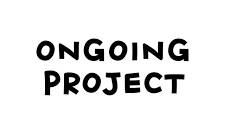

 
 

<h2 align=center>I'm Vithushan Kanesamoorthy.</h2>

 Motivated and passionate IT undergraduate, actively seeking a Software Engineer Intern to apply my
 problem-solving skills, full-stack development knowledge, and eagerness to learn in delivering efficient,
 real-world software solutions.

 

<h2 align="left">Languages & Tools:</h2>

### 💻 Programming Languages

  
  
  
  
  

### 🌐 Web Development

  
  
  
  

### 📱 Mobile Development

  
  

### 🗄️ Databases

  
  
  

### ☁️ Cloud & DevOps

  
  
  

### ⚙️ Tools & Platforms

  
  
  
  
  

 
 
<h2 align="left">Featured Projects:</h2>
 

<table align="center">
<tr>
  <!-- Project 1 -->
  <td align="center" width="50%">
    <h3>TourLink</h3>
    
 An application where users can view popular places, post custom tours and receive bids from drivers, while drivers can also publish package-based tours.

    
    

      
    

    
<strong>Tools & Technologies: ReactJs, Spring boot, Flutter, MySQL, IntelliJ IDEA</strong> 

    
  </td>

  <!-- Project 2 -->
  <td align="center" width="50%">
    <h3>HABITRO</h3>
    
An application where users can track habits through AI-powered habit suggestions, offering gamification features, reminders, leaderboards.

    
    

      
      
    

    
<strong>Tools & Technologies: Flutter, Django, Firebase, Django Channels, WebSockets, MySQL, Figma </strong>

    
  </td>
</tr>

<tr>
  <!-- Project 3 -->
  <td align="center" width="50%">
    <h3>Orix</h3>
    
An responsive application where users can browse products by category, add items to cart, checkout securely, and manage personal details with Firebase backend.

    
    

      
    

    
<strong>Tools & Technologies:Flutter, Getx, Firebase</strong>

    
  </td>

  <!-- Project 4 -->
  <td align="center" width="50%">
    <h3>Ex Studios.</h3>
    
A responsive movie ticket booking web application where users can view movie listings, select seats, select shows and book tickets online.

    
    

      
      
    

    
<strong>Tools & Technologies: HTML, CSS, JavaScript</strong>

    
  </td>
</tr>
</table>

 

                                                                                      
 

